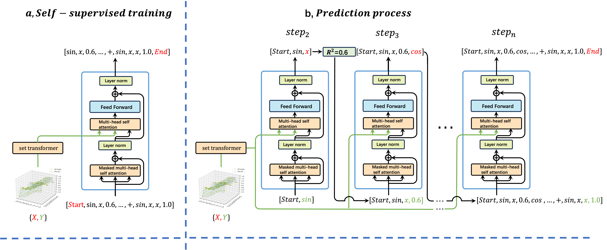

# Distills the Symbolic Regression Algorithms based on Reinforcement Learning into a Transformer by Modeling Their Learning History Sequences


[](https://www.python.org/)
[](https://opensource.org/licenses/Apache-2.0)
[](https://github.com/username/repo)
[](https://github.com/username/repo)

---
## Rebuttal

**Reviewer W4MF**

**Q13**

Dear reviewers, we may not have a good example, but the following example of binary function may be better understood by you.

For the expression: y = sin($x_1$) + cos($x_2$)

Get data sampling points: [X, y] = [$x_1 $, $x_2$ y] (random sampling first $x_1 $, $x_2 $, then enter the above expression to calculate the corresponding values of y)

Output sequence  : [ *, sin, $x_1$, $x_2$, 0.22 +, sin, $x_1$, sin, $x_2$, 0.76 +, cos, $x_1$, sin, $x_2$, 0.48 +, cos, $x_1$, cos, $x_2$, 0.81, +, sin, $x_1$, cos +, $x_2$, $x_2$, 0.99 +, sin,$ x_1$, cos, $x_2$, 1.00].

The output sequence is the search process of DSR. First of all, we sampled data $(X, y) = (x_1, x_2,.., y] $as input, and then the DSR first search to get the optimal expression for sin ($x_1$) * $x_2$, $R ^ 2$ = 0.22; Then, after using the risk policy gradient to update the policy network parameters, the second search was carried out, and the optimal expression obtained was sin($x_1$)+sin($x_2$), $R^2$=0.76. Similarly, iterating the above process, the optimal expression obtained in the sixth search is the target expression sin($x_1$)+cos($x_2$), $R^2$=1.00.

To summarize, for the expression y = sin($x_1$) + cos($x_2$), we have collected one training data of FormulaGPT: {[X, y], [ *, sin, $x_1$, $x_2$, 0.22, +, sin, $x_1$, sin, $x_2$, 0.76 +, cos, $x_1$, sin, $x_2$, 0.48 +, cos, $x_1$, cos, $x_2$, 0.81, +, sin,$ x_1$, cos, +, $x_2$, $x_2$, 0.99 +, sin, $x_1$, cos, $x_2$, 1.00]}

**Q14**

Dear reviewer, what you said is quite right. However, we have already introduced the importance of SR at the beginning of the introduction. This may not be enough, but we will add more.
Secondly, the current symbolic regression methods almost use these symbols, and the well-known Fourier series can approximate any curve, but it is equivalent to only using the four symbols [sin,+,\*,c], so the representation ability of this symbol library is sufficient.

**Q15**

DSO only introduces GP on the basis of DSR, and the search process of both is very similar. So the collected training data is also completely consistent in form.

**Q17**

Dear reviewers, D represents the sampled data point D=[X,y]=[$x_1$,$x_2$,...,y].

**Q19**

Dear Reviewer, this strange reference refers to Section 4.6 of the article, which describes ablation experiments on "shortcut" data.

**Q20**

We use Python's sympy library to call the BFGS optimizer directly. For example, for the expression y = sin(C * x), we take X as input and y as output and use the BFGS optimizer to get the value of the constant C.

**Q21**

The source of RL refers to the fact that we train a Transformer through a large number of inference process sequences of an RL-based SR algorithm so that the RL-based SR algorithm distills into the Transformer. After training, the Transformer can directly generate RL's search process when new data comes in, without going through multiple rounds of iterations. We highly recommend you to take a look at the article referenced in our introduction,** https://arxiv.org/pdf/2210.14215**.

**Q22**
Dear reviewers, there may be a problem in our presentation. We will change the presentation in the paper. 'Massive data' means that the 15M data we use is indeed relatively large, and 'limited training data' means that the 15M data we use now does not make formulaGPT have the ability to solve very complex problems. If you want to solve more complex problems, More training data may be required.


**Q24**
Dear reviewer, in real inference, $ R^2$ does not always go up as in shortcut data. Instead, in most cases, $ R^2$ shows an upward trend in volatility like reinforcement learning, as shown in Figure 7 in the appendix of the article. Because we're distilling RL into the transformer.

**Q25**
Dear reviewers, our work is not just about "using Transformers to do X". NeSymRes are inputs [X,y] that directly generate a preorder traversal of an expression (not the learning process of SR algorithms based on reinforcement learning), which might be like you said using Transformers to do X. However, our contribution is on a higher level. We try to explore a way to distill the reinforcement learning-based SR algorithm into a transformer so that the transformer can directly generate the learning process of the reinforcement learning-based SR algorithm. At the same time, it has the advantages of high efficiency of SR algorithm based on pre-training and good robustness of SR algorithm based on reinforcement learning.


## Abstract

Mathematical formulas are the human language used to describe nature. Discovering these formulas from observational data is a major challenge in artificial intelligence, known as symbolic regression (SR). Traditionally, SR has been tackled as a combinatorial optimization problem using genetic programming (GP) or reinforcement learning algorithms, which offer strong noise robustness and interval robustness but suffer from long inference times and low search efficiency. 
Later, pretraining-based methods were proposed, which train a transformer using a large number of artificially generated data pairs. These methods have very high inference efficiency, but their noise robustness and interval robustness are poor due to their strong dependence on the training data.\\
So, can we combine the advantages of the above two categories of SR algorithms?
In this paper, we treat the learning history of reinforcement learning-based SR algorithms as a long causal sequence. Next, we train a transformer with sampled data points [X,y] as input and learning history sequences as output. 
After training, the SR algorithm based on reinforcement learning is distilled into a Transformer. When new test data comes, The Transformer can directly generate a `reinforcement learning process' and automatically update the learning policy during the generation process. We called our method formulaGPT and tested it on more than ten datasets including SRBench, formulaGPT achieves state-of-the-art performance in fitting ability compared with four baselines. In addition, it achieves satisfactory results in noise robustness, interval robustness, and inference efficiency.

<p align="center">
    
</p>

## contributions

- We propose a symbolic regression algorithm, FormulaGPT, which not only has good fitting performance on multiple datasets but also has good noise robustness, interval robustness, and inference efficiency. 
- We regard the learning history of the reinforcement learning-based SR algorithm as a long causal sequence, and use the massive learning history sequences collected as training data to train a transformer. Experiments show that when new data comes, the trained transformer can automatically update the policy during the generation process. 
- We extract a series of `shortcut' training data from each history sequence. That is a path where $R^2$ goes all the way up, with no oscillations. Experiments show that this operation can greatly improve the performance of formulaGPT.

## Quick Installation

### Prerequisites

- Python 3.7 or higher
- PyTorch 1.7 or higher
- Basic knowledge of deep learning and symbolic regression

### Installation Steps

```bash

# Create and activate a virtual environment
python3 -m venv venv
source venv/bin/activate

# Install dependencies
pip install -r requirements.txt
```

---

## Getting Started

### 1. Start Training

#### Configuration

```python
# Example configuration for training
save_pth = 'formulaGPT-epoch-ex.pth'  # Path to save the trained model
train_data_filename = "train_data.json"  # Path to your training data

# Hyperparameters
epochs = 400
src_len = 8  # Maximum sequence length for encoder input
tgt_len = 16  # Maximum sequence length for decoder input/output

# Transformer Parameters
d_model = 512  # Embedding size
d_ff = 2048  # FeedForward dimension
d_k = d_v = 64  # Dimension of K and V
n_layers = 6  # Number of Encoder/Decoder layers
n_heads = 8  # Number of attention heads
```

#### Run Training

```bash
python formulaGPT_train.py
```

---

### 2. Start Inference

#### Configuration

```python
# Example configuration for inference
model_pth = 'formulaGPT-epoch-10000.pth'  # Path to your trained model

# Ensure hyperparameters match those used during training
src_len = 8
tgt_len = 16
d_model = 512
d_ff = 2048
d_k = d_v = 252
n_layers = 8
n_heads = 16
```

#### Example Test Data

```python
import numpy as np

N_sample_point = 50
X = np.linspace(-4, 4, num=N_sample_point).reshape(N_sample_point, 1)
x1 = X[:, 0]
y = np.sin(x1 ** 2) + x1
```

#### Run Inference

```bash
python formulaGPT_test.py
```

---

## Results

When tested on datasets like SRBench, FormulaGPT achieves state-of-the-art performance. Here’s an example output:

```
################### The Best Expression ###################
The best $R^2$: 0.9999999999999951
The best expression:  ['+', 'sin', '*', 'var_x1', 'var_x1', 'var_x1']
```


---

## Contact

For any questions or feedback, feel free to reach out at [XXX](mailto:XXXX).

---

## License

This project is [Apache License 2.0](LICENSE)-licensed. Feel free to use, modify, and distribute this code as per the terms of the license.

---

Thank you for choosing FormulaGPT! We sincerely hope that our work can bring inspiration to your future research.
