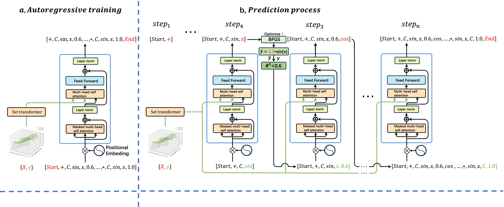

# Distills the Symbolic Regression Algorithms based on Reinforcement Learning into a Transformer by Modeling Their Learning History Sequences


[](https://www.python.org/)
[](https://opensource.org/licenses/Apache-2.0)
[](https://github.com/username/repo)
[](https://github.com/username/repo)

---


## Abstract

Mathematical formulas are the human language used to describe nature. Discovering these formulas from observational data is a major challenge in artificial intelligence, known as symbolic regression (SR). It is difficult for traditional methods to achieve a balance between inference efficiency and robustness. In this paper, we treat the learning history of reinforcement learning-based SR algorithms as a long causal sequence. Next, we use a transformer to model these causal sequences.
Then, the SR algorithm based on reinforcement learning is distilled into a Transformer. When new test data comes, The Transformer can directly generate a `reinforcement learning process' and automatically update the learning policy during the generation process. We called our method formulaGPT and tested it on more than ten datasets, including SRBench. formulaGPT achieves state-of-the-art performance in fitting ability compared with four baselines. In addition, it achieves satisfactory results in robustness and inference efficiency.

<p align="center">
    
</p>

## contributions

- We propose a symbolic regression algorithm, FormulaGPT, which not only has good fitting performance on multiple datasets but also has good noise robustness, interval robustness, and inference efficiency. 
- We regard the learning history of the reinforcement learning-based SR algorithm as a long causal sequence and use the massive learning history sequences collected as training data to train a transformer. Experiments show that when new data comes, the trained transformer can automatically update the policy during the generation process. 
- We extract a series of `shortcut' training data from each history sequence. That is a path where $R^2$ goes all the way up, with no oscillations. Experiments show that this operation can greatly improve the performance of formulaGPT.

## Quick Installation

### Prerequisites

- Python 3.7 or higher
- PyTorch 1.7 or higher
- Basic knowledge of deep learning and symbolic regression

### Installation Steps

```bash

# Create and activate a virtual environment
python3 -m venv venv
source venv/bin/activate

# Install dependencies
pip install -r requirements.txt
```

---

## Getting Started

### 1. Start Training

#### Configuration

```python
# Example configuration for training
save_pth = 'formulaGPT-epoch-ex.pth'  # Path to save the trained model
train_data_filename = "train_data.json"  # Path to your training data

# Hyperparameters
epochs = 400
src_len = 8  # Maximum sequence length for encoder input
tgt_len = 16  # Maximum sequence length for decoder input/output

# Transformer Parameters
d_model = 512  # Embedding size
d_ff = 2048  # FeedForward dimension
d_k = d_v = 64  # Dimension of K and V
n_layers = 6  # Number of Encoder/Decoder layers
n_heads = 8  # Number of attention heads
```

#### Run Training

```bash
python formulaGPT_train.py
```

---

### 2. Start Inference

#### Configuration

```python
# Example configuration for inference
model_pth = 'formulaGPT-epoch-10000.pth'  # Path to your trained model

# Ensure hyperparameters match those used during training
src_len = 8
tgt_len = 16
d_model = 512
d_ff = 2048
d_k = d_v = 252
n_layers = 8
n_heads = 16
```

#### Example Test Data

```python
import numpy as np

N_sample_point = 50
X = np.linspace(-4, 4, num=N_sample_point).reshape(N_sample_point, 1)
x1 = X[:, 0]
y = np.sin(x1 ** 2) + x1
```

#### Run Inference

```bash
python formulaGPT_test.py
```

---

## Results

When tested on datasets like SRBench, FormulaGPT achieves state-of-the-art performance. Here’s an example output:

```
################### The Best Expression ###################
The best $R^2$: 0.9999999999999951
The best expression:  ['+', 'sin', '*', 'var_x1', 'var_x1', 'var_x1']
```


---

## Contact

For any questions or feedback, feel free to reach out at liyanjie@semi.ac.cn.

---

## License

This project is [Apache License 2.0](LICENSE)-licensed. Feel free to use, modify, and distribute this code as per the terms of the license.

---

Thank you for choosing FormulaGPT! We sincerely hope that our work can bring inspiration to your future research.
